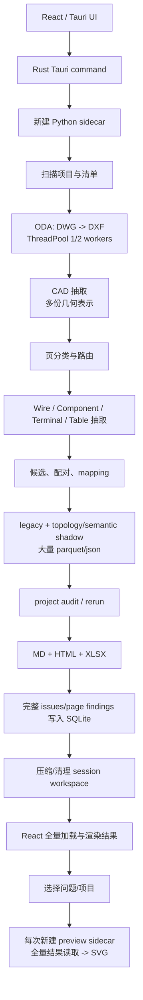

# XJToolkit 性能与生命周期审计

审计日期：2026-07-18

## 结论

当前卡顿不是单一的“ODA 并发为 4”问题。已检查的桌面默认配置实际只会在启动时把 ODA worker 解析为 1 或 2。更主要的确定性问题是：

1. ODA 只有一次性内存分档，没有运行期 CPU/内存门控、取消、超时和子进程树托管。
2. Python 正常流程会在一个进程中连续处理多个项目，并同时保留多套 CAD、legacy、topology 和 semantic shadow 表示；历史记录已经证明该进程会出现跨项目累计失稳。
3. 普通桌面运行无条件执行开发期 shadow/topology 计算、写出大量 parquet，并默认生成 Markdown、HTML、XLSX 报告。
4. 项目切换会重新加载并 JSON 解码完整 issues/page findings；问题列表全量进入 React，没有分页或虚拟化。
5. 每次预览都会启动新的完整 sidecar、加载完整项目结果，必要时读取整套 parquet，再生成、写入并回传 SVG。现有预览取消是全局、尽力而为，项目结果加载还有旧响应覆盖新项目的竞态。
6. 抽取/配对本身没有隐藏的 Python worker pool。卡顿更可能来自同步热点、ODA/native 内部线程、正常优先级的重进程、重复物化和重复进程启动。

## 当前业务流程



当前 `run_analysis_workflow` 先完成所有项目的抽取，再统一审计；因此多个项目的中间目录和状态存活时间被拉长。预览是另一条独立路径，但同样每次创建重型 sidecar。

## 已确认问题与优先级

| 优先级 | 已确认问题 | 直接影响 | 关键位置 |
|---|---|---|---|
| P0 | 预览只有全局 generation/PID 取消，没有 request 级所有权和可靠子树托管 | 快速切换时旧工作可能继续占 CPU/内存 | `main.rs:301-317, 518-695`; `App.tsx:651-701` |
| P0 | 项目结果异步加载无 generation/project guard | A 的晚响应可覆盖已经选择的 B | `App.tsx:167-187` |
| P0 | 生产流程无条件构建完整 shadow/topology/semantic 产物 | 重复 CPU、内存、磁盘放大且不改变 legacy 结果 | `artifacts.py:381-1215` |
| P0 | 多项目共享同一个 Python 分析进程 | native/Python 状态累计；历史已有四项目后非零退出证据 | `pipeline.py::analyze_input_root` |
| P1 | ODA 自动模式只启动前采一次可用内存；所有 future 一次性提交 | 无运行期压力反馈、背压、取消或普通转换超时 | `dwg_converter.py:34-76, 241-303` |
| P1 | 每次预览启动完整 sidecar并读取完整项目结果 | 启动/import、SQLite/JSON、pandas、SVG 重复开销 | `preview.py::render_project_preview`; `main.rs:301-317` |
| P1 | 结果 API 与 UI 全量加载/规范化/渲染 | 项目越大，切换时分配和主线程工作越大 | `state_store.py::load_latest_project_result`; `desktopApi.ts:192-264`; `App.tsx:1196-1236` |
| P1 | 报告 rerun 读取整套 frame 两次，并默认生成三种报告 | pandas/openpyxl/HTML 额外峰值与磁盘写入 | `rerun.py:37,226`; `artifacts.py:3243-3245, 3578-3684` |
| P2 | 线组、候选、配对、表格分格存在可避免的二次/笛卡尔扫描 | 大而密集的单图纸可长时间占满一个核心 | `line_groups.py:94-112`; `pairs.py:238-241`; `table_extractor.py:1016-1036` |
| P2 | recent/cleanup 路径递归扫描历史 workspace，并逐 run 更新 | 打开最近项目或退出时出现磁盘/CPU 尖峰 | `desktop/lifecycle.py`; `state_store.py` |

## 资源治理设计

资源治理不能只用一个“CPU 80%”判断。ODA 可能自己创建多线程，磁盘阻塞时 CPU 又可能不高；Python/native 内存也独立于 worker 数。因此需要 Tauri 全局协调器和 Python ODA admission gate 两层职责，但只使用同一份设置和遥测状态。

### 所有权

| 层 | 必须拥有的职责 |
|---|---|
| React | 只表达当前用户意图，生成/保存 `request_id` 与 `generation`，拒绝旧结果 |
| Tauri `WorkCoordinator` | 全局 analysis/preview/cleanup lane、Child registry、Windows Job Object、优先级、资源采样、硬取消 |
| Python project worker | 单项目阶段状态机、有限 ODA in-flight 队列、合作取消检查、阶段落盘和释放 |
| ODA | 被托管的叶子进程；不拥有重试、并发和桌面状态 |

### 自适应 ODA 策略

- 默认 `balanced/auto` 的硬上限仍为 2，不因高端 CPU 自动升到 4；先用 profiler 证明吞吐收益后再开放自定义上限。
- 每 1 秒采样系统 CPU、物理内存可用量和当前 Job 工作集，使用约 5 秒 EWMA，避免瞬时尖峰触发抖动。
- 连续 3 次满足 `CPU >= 80%`，或内存使用 `>= 80%`，或可用内存低于 `max(2 GiB, 15% total)`：停止启动新任务；目标并发降到 1。
- 内存进入严重压力（例如 `>= 90%` 或可用量低于安全保留）：目标并发为 0，只暂停新任务。除用户取消外，不为“降并发”强杀正在转换的文件。
- CPU `<= 65%` 且内存使用 `<= 70%` 连续 10 秒后，每个 cooldown 只增加一个 permit，最多回到配置上限。
- 不再一次性提交所有 DWG。队列仅保持 `active permits + 1` 个已取出的任务，其余保留为未启动记录。
- 每个转换记录 queue wait、duration、PID/descendants、peak working set、exit/timeout/cancel 原因。按历史 P95 峰值更新每任务内存估算，后续 permit 同时受 `floor((available - UI reserve) / estimated_job_peak)` 限制。
- analysis/ODA 使用 `BELOW_NORMAL_PRIORITY_CLASS`；启动前限制 `OMP/OPENBLAS/MKL/NUMEXPR` 等 native 线程。CPU affinity 和 Job CPU hard cap 只在测量证明有必要时启用。

### 分析生命周期

```text
queued -> converting -> extracting -> routing -> pairing
       -> persisting -> auditing -> storing -> compacting -> exited
                         |                           |
                      cancelled/failed ----------> exited
```

- 一个 project generation 对应一个受 Job Object 托管的 Python worker；默认项目间串行。
- 每个项目完成 `store + compact` 后立即退出进程，OS 负责彻底回收 pandas/Arrow/Shapely/ezdxf/native 状态。
- 下一项目从耐久 manifest/checkpoint 启动。失败只保留错误元数据，不保留大对象或孤儿子进程。
- 暂不增加 page worker 并发。先消除 shadow 放大、做项目隔离并完成 profiling；之后最多从 1 开始受同一资源 permit 控制。

## 结果与预览设计

### Latest request wins

1. 每次项目或问题选择产生唯一 `request_id`，并递增对应 generation。
2. Tauri 在 preview lane 中自动取消旧 request，关闭其 Job Object/终止子树并等待确认；不能只让前端 Promise 超时。
3. 新预览只在旧进程退出或短暂硬取消截止后取得唯一 preview permit。
4. 返回值携带 `request_id + project_id + generation + data_version`；Rust 和 React 两层都验证后才提交 UI。
5. “取消旧预览”应始终启用，因为旧结果已无用户价值。设置页只控制自动预览和高负载暂停策略。

### 数据与渲染

- 把完整 `load-result` 拆成 `project-summary`、`list-issues(cursor, limit, filters)`、`issue-detail(issue_id)` 和按需 `page-findings`。
- SQLite 按 `project/generation/issue_id` 直接查选中 issue；状态更新执行定点 `UPDATE`，不先读取完整结果。
- 问题列表分页或虚拟化，推荐每页 100 条；切换项目时先显示摘要，详情惰性加载。
- 预览先查版本化 LRU cache。缓存 key 至少包含 project generation、issue、sheet、line group、renderer version。
- 常见完成态直接使用 SQLite 中的最小 evidence，不加载 18 个 parquet。返回 cache 文件路径或二进制资源 URL，不同时回传完整 SVG 文本。
- 第二阶段可把 preview 改为 Tauri 托管的常驻轻量 renderer，避免每次支付 PyInstaller/import/pandas 启动成本；必须有空闲超时和 Job 生命周期。
- `list-recent-projects` 不同步做递归 stale cleanup；清理进入低优先级后台 lane，并按 session 索引批量更新。

## 设置页

建议使用现有产品约定的设置对话框/侧栏，持久化版本化 `DesktopSettings`：

| 控件 | 默认值 | 说明 |
|---|---|---|
| 性能模式 | 自动/均衡 | 自动、节能、最高速度、自定义 |
| 系统繁忙时暂停新任务 | 开 | CPU/内存压力下停止 admission |
| ODA 最大并发 | 2 | 自动模式是上限，不是固定活跃数 |
| 分析期间自动预览 | 开 | 资源压力时可暂停并显示等待状态 |
| 选择问题后自动预览 | 开 | 关闭后由用户显式点击预览 |
| 诊断产物 | 关 | 开启 topology/semantic shadow 和完整 parquet |
| 报告生成 | 按需导出 | HTML/XLSX 不再伴随每次分析自动生成 |
| 预览缓存上限 | 256 MiB | LRU 清理，不在最近项目查询中同步全扫 |

阈值、线程数等高级参数只在“自定义”中显示。设置变更应记录版本和本次 run 的最终 resolved policy，便于复现。

## 实施顺序

1. **Telemetry PR**：加 session/project/request ID、阶段耗时、CPU/RSS、child PID、queue wait、IPC bytes、cache/cancel 指标，不改变语义。
2. **Cancellation PR**：Windows Job Object + Child registry + preview request ID；修复 React 项目加载 generation guard；增加真实 child kill/reap 测试。
3. **Production profile PR**：默认关闭 shadow/topology/完整 debug artifacts，HTML/XLSX 改为显式导出；用现有 golden 证明 legacy 结果不变。
4. **Project isolation PR**：按项目启动 worker，完成即 store/compact/exit；加入连续多项目内存回落和孤儿进程测试。
5. **Adaptive ODA PR**：有限 in-flight 队列、滞回门控、优先级/native thread caps、timeout/cancel、资源遥测。
6. **Result API PR**：摘要/分页/详情查询、定点状态更新、SQLite 索引/WAL/busy timeout、React 虚拟列表。
7. **Preview PR**：直接 issue 查询、版本 cache、轻量/常驻 renderer、只返回资源路径。
8. **Hotspot PRs**：按 profiler 数据逐个优化 line group 索引、candidate-by-group、coordinate map、table bisect 和 CAD 单次遍历/按 profile gate。
9. **Settings PR**：接入版本化设置、运行时 resolved policy 和诊断导出。

## 验收指标

- 任意快速项目/问题切换都没有旧结果覆盖新状态；过期 preview 子树在 1 秒内消失，退出应用后 2 秒内无分析/ODA 后代进程。
- 均衡模式持续压力下 CPU EWMA 不长期越过 80%，内存压力触发后不再启动新 ODA；实际 active count 永不超过 resolved permits。
- 连续 10 个代表性项目后，每个项目 worker 退出后的桌面 working set 回到启动基线附近，不出现随项目数单调增长。
- 项目切换首屏只获取有界摘要/issue page；一次列表响应最多 100 条，主线程没有超过 50 ms 的长任务。
- cached preview P95 小于 300 ms，uncached preview P95 小于 1.5 秒；取消延迟 P95 小于 500 ms。
- production profile 相比当前基线峰值内存至少下降 30%，同时 legacy issues/pairs/golden 零变化。
- 每个基准报告机器配置、数据集、DWG 数、issue/relationship 数、run profile、cache 状态，避免用不同工作量比较。

## 本次验证

- Python：28 个 ODA、sidecar、state、lifecycle、preview 测试通过。
- Rust：9 个 generation、pipe、PID registry、shutdown selection、runtime policy 单元测试通过。
- Frontend：`tsc --noEmit` 和 `oxlint` 通过。
- 尚未运行真实 ODA 压力测试或业务数据 profiler；因此本文只把源码可直接证明的行为标为 confirmed，实际热点占比与数值收益必须由 Telemetry PR 建立基线。

